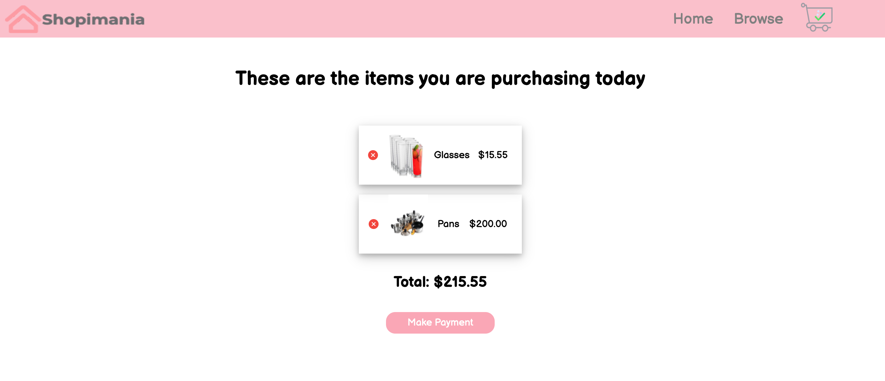

# Shopimania Shop

## Description
This project is an simulates an online store with its respective browse , shopping cart, and payment page. This application uses the session_start() function to initialize the $_SESSION varialbe, which will keep track afo all the items that are 
added and removed from the cart. 

 ## Link to web app

https://nefi-store-project.herokuapp.com/webpages/home.php

 
 
 

## Lenguages Used 
 - HTML
 - CSS
 - Javascript
 - PHP

 ## Set Up Insctuctions 
 This application is ready to be cloned and used if you want to run it from your computer. 
  
 Open your terminal and navegate to the folder where you want to save this application 
  
 Run this command in the terminal: 
  
 git clone https://github.com/solemnefi153/shopping-cart.git

